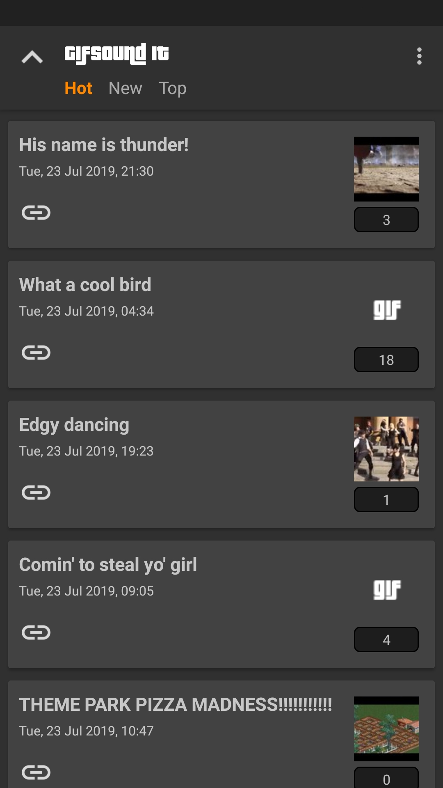
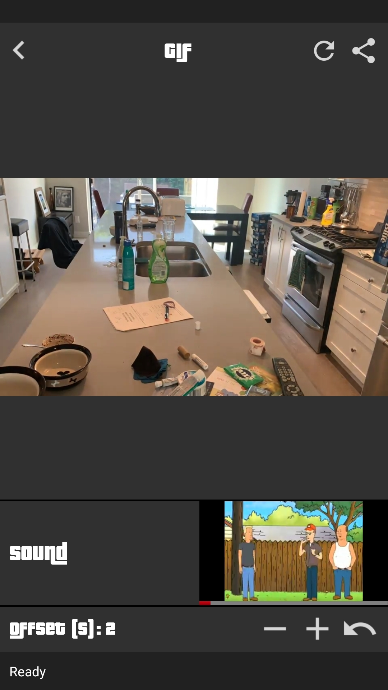

<a href='https://play.google.com/store/apps/details?id=com.kostaslou.gifsoundit&pcampaignid=MKT-Other-global-all-co-prtnr-py-PartBadge-Mar2515-1'></a>

# GifSound-It
My kotlin workspace 

(__Note__: the version in the Google Play Store is the old one)

## What it is / Motivation
After browsing [r/GifSound](https://www.reddit.com/r/GifSound), [r/MusicGifStation](https://www.reddit.com/r/MusicGifStation) etc. for some time, I realized that the website https://gifsound.com is not meant to be displayed to mobile devices and thus cannot accurately represent the awesomeness of these subreddits' content. That and the fact that I wanted to practice/learn more of Kotlin, led me to creating this app and ruining my productivity henceforth. 

It substitutes the site functionally, meaning that you can use it to open gifsound.com links from anywhere. It also uses the reddit API to get the top/hot/new posts of r/GifSound so I can get more engagement :sunglasses: (Can add more gifsound-related subreddits in the future if it is requested)

It basically is my fun test workspace for all things Kotlin and proper native Android development. I will also try to document the tools I use and the general process for anyone that might be interested.

 

## Architecture

It is a single activity application that features a fragment for every screen and is organized in an [MVVM](https://en.wikipedia.org/wiki/Model%E2%80%93view%E2%80%93viewmodel) fashion. The primary reason that led me to choose a single activity architecture is really the performance benefit, since opening a different activity each time we want to navigate to a new screen, bears a much bigger performance toll than navigating with simple fragments. 

The layers of the architecture implemented in this app are the following:

### View / Presentation layer

Each view/fragment has its own ```ViewModel```. It acts as a mediator between the ```View``` and the ```Repository``` in the sense that when a View wants to request data, it relays that request to the repository and observes its [PublishSubjects](http://reactivex.io/RxJava/javadoc/io/reactivex/subjects/PublishSubject.html). These are observables that emit asynchronously data or error messages, depending on whether the repository succeeded in fetching the data or not. 

Upon getting these data and/or messages, the ViewModel first transforms them in a way that the View will understand them and then updates the corresponding [LiveData](https://developer.android.com/topic/libraries/architecture/livedata) that the View listens to.

Combining the [LiveData](https://developer.android.com/topic/libraries/architecture/livedata) and [ViewModel](https://developer.android.com/topic/libraries/architecture/viewmodel) from the [Android Architecture Components](https://developer.android.com/topic/libraries/architecture) libraries, gives us the ability to retain the state of the fragment during a configuration change (e.g orientation change), since they do not get destroyed when a fragment is destroyed, but rather when it is finished. This results to fewer network requests/disk IO. 

### Model / Data layer

This layer contains the classes/interfaces for the ```network``` access (Reddit API) and the ```disk``` I/O (SharedPreferences), as well as the ```Repository```. The Repository basically is responsible to respond to any request that a ViewModel might make, by first choosing from where it will get the data (network or disk) and then sending the fetched data (or the error messages) to the Observables that the ViewModel is listening on. 

## Modularization

Every view/fragment is placed in its own gradle library module. This is to further achieve separation of concerns and faster gradle build times. The app module (that contains the Activity and the Application) then loads these modules and is able to navigate between them using the [Navigation](https://developer.android.com/guide/navigation) component and its graph. To achieve navigation across the rest of the modules, the navigation IDs are stored in the ```common``` module. It can then be declared as a dependency for any module that may need to partake in the navigation.

## Testing

When it comes to testing, the MVVM architecture makes things a lot easier, since it completely decouples the classes/layers. The fact that the connections are one-way (every layer listens only to the one ahead of it), makes unit testing a breeze, since for every [SUT](https://en.wikipedia.org/wiki/System_under_test), we just have to mock (here i use Mockito/Mockito-kotlin) the behaviour of the layer it listens to. 

As for the intrumentation/ui testing, the espresso library is utilized. Furthermore these tests are organized with the so called robot pattern, which was introduced at [this](https://jakewharton.com/testing-robots/) talk by Jake Wharton.

## Notes / Other techniques used

### Techniques

* __Delegate RecyclerView Adapters__: This technique aims to eliminate the problem of maintaining a huge monolithic recyclerview adapter when you have multiple different ViewTypes. We basically split the main adapter into as many delegates as there are ViewTypes and during the ```onCreateViewHolder()``` and ```onBindViewHolder()```, the respective ones from the right delegate are called. This adds modularity and extensibility to the RecyclerView adapter logic.

## Libraries / Tools / Frameworks used

* [Retrofit](https://github.com/square/retrofit) - Used to communicate with the userless Reddit API, combined with the [RxJava2 Adapter](https://github.com/square/retrofit/tree/master/retrofit-adapters/rxjava2), so that the responses are wrapped in RxJava2 types, which makes their handling much easier (in this project Single< T > types were used.)

* [Moshi](https://github.com/square/moshi) - To parse the JSON object of the Retrofit response to Java classes.

* [RxJava2](https://github.com/ReactiveX/RxJava) - It is used to pass messages and data between the API->Repository and Repository->ViewModel asynchronously.

* [RxAndroid](https://github.com/ReactiveX/RxAndroid) - Provides the main thread (UI) scheduler for the Android execution environment.

* [Dagger](https://github.com/google/dagger) - Cleans up the code by removing the part that has to do with initializing dependencies in a class. Instead they are generated by dagger at compile time and injected at runtime, releasing the dev from this task completely. Used specifically the ```dagger-android``` API, that allows easy injections to android owned classes (like Application, Activity, Fragment) by reducing the boilerplate that is associated with this task.

* [ViewModel](https://developer.android.com/topic/libraries/architecture/viewmodel) - Class that binds to the lifecycle of a Fragment or Activity and does not get destroyed/recreated during a configuration change. It only gets cleared when its Lifecycle Owner has normally finished. It can therefore retain state. (It was not used in the screen that plays the Gifsound, since youtube did not play well with it).

* [LiveData](https://developer.android.com/topic/libraries/architecture/livedata) - Used in conjuction with the aforementioned ViewModel. It basically is a lifecycle-respecting data holder, that keeps its data during a configuration change and feeds it back to its Fragment or Activity after it has finished recreating. 

* [Navigation](https://developer.android.com/guide/navigation) - Used to navigate between the fragment/modules in the app.

* [Anko](https://github.com/Kotlin/anko) - Provides code simplicity by leveraging Kotlin idioms to reduce boilerplate in different scenarios/tasks (It was used to spawn toasts and snackbars)

* [Timber](https://github.com/JakeWharton/timber) - For the logging

* [Glide](https://github.com/bumptech/glide) - For the animated GIFs and image loading

* [Firebase](https://firebase.google.com/) - For the crash reporting/tracking (Using Fabric Crashlytics)

* [YouTube Android Player API](https://developers.google.com/youtube/android/player) - For obvious reasons

* [JUnit](https://github.com/junit-team/junit4) / [Mockito](https://github.com/mockito/mockito) - For the Unit tests. The library [mockito-kotlin](https://github.com/nhaarman/mockito-kotlin) was also used, in order to write mocks in a more kotlin-idiomatic way.

* [Espresso](https://developer.android.com/training/testing/espresso) - For the instrumentation testing
 
## Author

* **Konstantinos Lountzis** - [loukwn](https://github.com/loukwn/)

## License

This project is licensed under the MIT License - see the [LICENSE](LICENSE) file for details

## Acknowledgments

* Hat tip to the folks that created the website: https://gifsound.com
