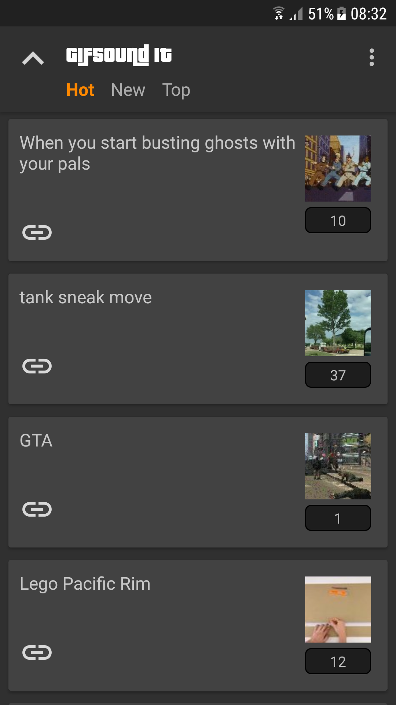
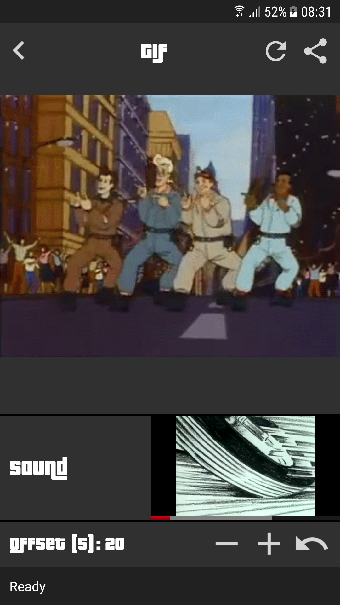

# GifSound-It
Just have fun

## What it is / Motivation
After browsing [r/GifSound](https://www.reddit.com/r/GifSound), [r/MusicGifStation](https://www.reddit.com/r/MusicGifStation) etc. for some time, I realized that the website https://gifsound.com is not meant to be displayed to mobile devices and thus cannot accurately represent the awesomeness of these subreddits' content. That and the fact that I wanted to practice/learn more of Kotlin led me to creating this app and ruining my productivity henceforth. 

It substitutes the site functionally, meaning that you can use it to open gifsound.com links from anywhere. It also uses the reddit API to get the top/hot/new posts of r/GifSound so I can get more engagement :sunglasses: (Can add more subreddits in the future if it is requested)

It basically is my fun test workspace for all things Kotlin and proper native Android development. I will also try to document the tools I use and the general process for anyone that might be interested.

 

## Libraries / Tools / Frameworks used

* [Retrofit](https://github.com/square/retrofit) - For the consumption of the userless Reddit API
* [RxJava](https://github.com/ReactiveX/RxJava) - For the async calls / MVP abstraction
* [RxAndroid](https://github.com/ReactiveX/RxAndroid) - For the Main thread Scheduler
* [Anko](https://github.com/Kotlin/anko) - For my sanity
* [Glide](https://github.com/bumptech/glide) - To make me believe in magic (and to load images and GIFs)
* [Fabric](https://fabric.io) - For the crash tracking
* [YouTube Android Player API](https://developers.google.com/youtube/android/player) - For obvious reasons

Planning to incorporate/learn the following too:
* [Dagger](https://github.com/google/dagger) - Dependency injection
* [Room](https://developer.android.com/topic/libraries/architecture/room) - For the local data
* More about Clean Architecture

## Author

* **Konstantinos Lountzis** - [loukwn](https://github.com/loukwn/)

## License

This project is licensed under the MIT License - see the [LICENSE.md](LICENSE.md) file for details

## Acknowledgments

* Hat tip to the folks that created the https://gifsound.com
