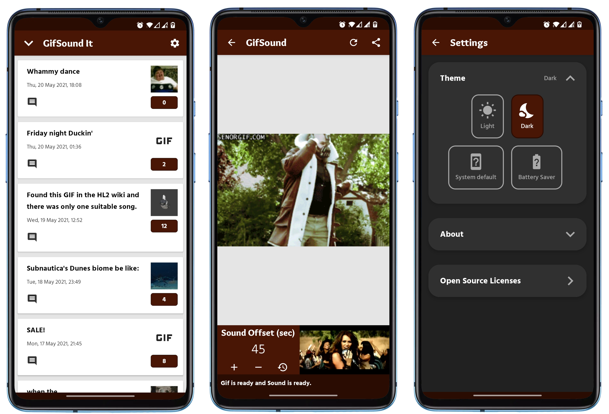

<!--  -->

# GifSound-It
My Android / Kotlin workspace. For more check the [wiki](https://github.com/loukwn/GifSound-It/wiki).

## What it is / Motivation
After browsing [r/GifSound](https://www.reddit.com/r/GifSound), [r/MusicGifStation](https://www.reddit.com/r/MusicGifStation) etc. for some time, I realized that the website https://gifsound.com is not meant to be displayed to mobile devices and thus cannot accurately represent the awesomeness of these subreddits' content. That and the fact that I wanted to practice/learn more of Kotlin, led me to creating this app and ruining my productivity henceforth. 

It substitutes the site functionally, meaning that you can use it to open gifsound.com links from anywhere. It also uses the reddit API to get the top/hot/new posts of r/GifSound, r/MusicGifStation, r/AnimeGifSound so I can get more engagement :sunglasses:.

It basically is my fun test workspace for all things Kotlin and proper native Android development. I will also try to document the tools I use and the general process as a reference for me or for anyone that might be interested.

## Author

* **Konstantinos Lountzis** - [loukwn](https://github.com/loukwn/)

## License

This project is licensed under the MIT License - see the [LICENSE](LICENSE) file for details

## Acknowledgments

* Hat tip to the folks that created the website: https://gifsound.com
